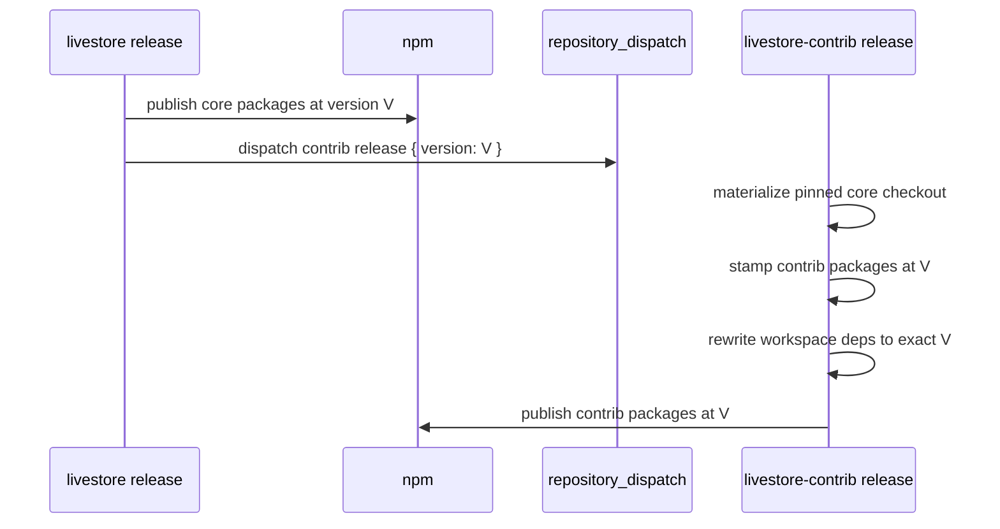

# Delivery Release — Spec

This document specifies the release flow across the two repositories. It
builds on [requirements.md](./requirements.md). Step-by-step operator
procedures live in the companion runbooks
([package-release-runbook.md](./package-release-runbook.md),
[release-workflows-runbook.md](./release-workflows-runbook.md),
[dependency-management.md](./dependency-management.md)); this spec owns the
contract they realize.

## Status

Draft — the lockstep release contract below is active; a first contrib
release has not yet exercised it (LS.DEL.REL-DQ1).

## Scope

Defines: publish-time dependency resolution, the lockstep release flow, and
dependency-update policy ownership. Does not define: workspace composition
([../01-composition/](../01-composition/spec.md)) or artifact flows
([../03-artifacts/](../03-artifacts/spec.md)).

## Publish-Time Dependency Resolution

Contrib release manifests replace `workspace:*` dependencies on core
packages with the exact core version being published (LS.DEL.REL-R02):

```json
{
  "dependencies": {
    "@livestore/framework-toolkit": "0.4.2",
    "@livestore/livestore": "0.4.2"
  }
}
```

No contrib package publishes a range dependency on a core package. Exact
versions make a published release graph deterministic for users.

## Release Flow



Manual contrib release dispatch accepts an explicit version but must use a
version already published by core (LS.DEL.REL-R05).

## Breaking-Change Mechanics (LS.DEL.REL-R06)

Beta releases may break in three distinct ways (user-facing promise:
`../../01-product/spec.md` §Maturity & Stability Promise):

| Kind | Mechanism | Consequence |
| --- | --- | --- |
| API | public API change in a minor release | code migration, guided by release notes |
| Client storage format | `liveStoreStorageFormatVersion` bump | persisted client state resets (see `02-system/02-state/01-sqlite/02-schema-management/`) |
| Sync backend storage format | provider persistence change (e.g. `PERSISTENCE_FORMAT_VERSION`) | backend soft-reset per provider (see `02-system/03-sync/03-cf/`) |

Release notes classify each breaking change by kind and include a migration
path where feasible.

## Dependency-Update Policy

Dependency updates follow the policy documented in
[dependency-management.md](./dependency-management.md) (version ranges,
catalog usage, upgrade cadence). The runbook is operational; changes to the
policy itself are spec changes to this node.

## Open Design Questions

- **LS.DEL.REL-DQ1 First contrib release proof:** Exercise the contrib
  release workflow with a dry-run or controlled first release before relying
  on it for routine releases.
