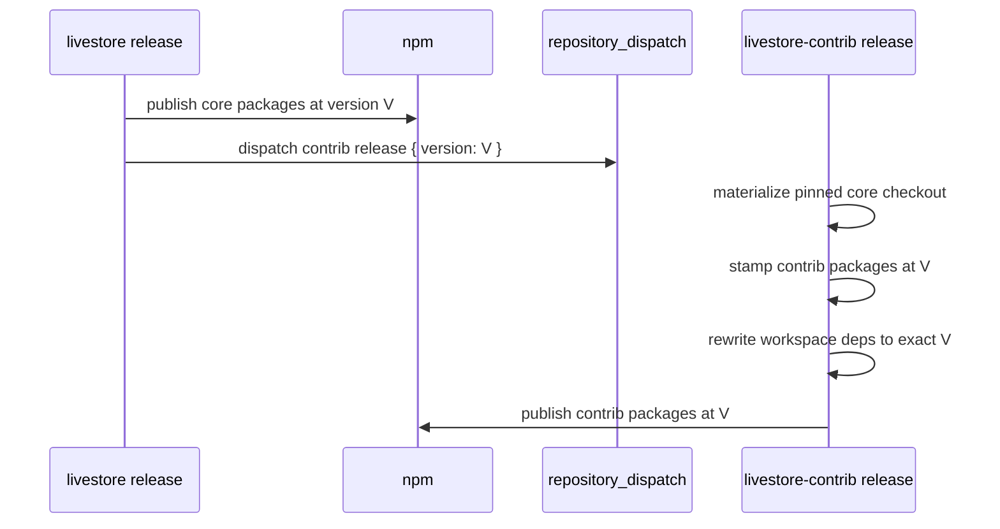

# Delivery Release — Spec

This document specifies the release flow across the two repositories. It
builds on [requirements.md](./requirements.md). Step-by-step operator
procedures live in the companion runbooks
([package-release-runbook.md](./package-release-runbook.md),
[release-workflows-runbook.md](./release-workflows-runbook.md),
[dependency-management.md](./dependency-management.md)); this spec owns the
contract they realize.

## Status

Draft — the lockstep release contract below is active; a first contrib
release has not yet exercised it (LS.DEL.REL-DQ1).

## Scope

Defines: publish-time dependency resolution, the lockstep release flow, and
dependency-update policy ownership. Does not define: workspace composition
([../01-composition/](../01-composition/spec.md)) or artifact flows
([../03-artifacts/](../03-artifacts/spec.md)).

## Publish-Time Dependency Resolution

Contrib release manifests replace `workspace:*` dependencies on core
packages with the exact core version being published (LS.DEL.REL-R02):

```json
{
  "dependencies": {
    "@livestore/framework-toolkit": "0.4.2",
    "@livestore/livestore": "0.4.2"
  }
}
```

No contrib package publishes a range dependency on a core package. Exact
versions make a published release graph deterministic for users.

## Release Flow



Manual contrib release dispatch accepts an explicit version but must use a
version already published by core (LS.DEL.REL-R05).

## Breaking-Change Mechanics (LS.DEL.REL-R06)

Beta releases may break in three distinct ways (user-facing promise:
`../../01-product/spec.md` §Maturity & Stability Promise):

| Kind | Mechanism | Consequence |
| --- | --- | --- |
| API | public API change in a minor release | code migration, guided by release notes |
| Client storage format | `liveStoreStorageFormatVersion` bump | persisted client state resets (see `02-system/02-state/01-sqlite/02-schema-management/`) |
| Sync backend storage format | provider persistence change (e.g. `PERSISTENCE_FORMAT_VERSION`) | backend soft-reset per provider (see `02-system/03-sync/03-cf/`) |

Release notes classify each breaking change by kind and include a migration
path where feasible.

## Dependency-Update Policy

Dependency updates follow the policy documented in
[dependency-management.md](./dependency-management.md) (version ranges,
catalog usage, upgrade cadence). The runbook is operational; changes to the
policy itself are spec changes to this node.

## Ruleset Reconciliation

The `main` branch ruleset is kept converged with its committed desired state
(`.github/repo-settings.json`, whose required-status-check list Genie generates
from the CI job list) by an org-owned GitHub App that applies it — closing the
last IaC gap (automated apply). Decisions and rejected alternatives:
[.decisions/0001](./.decisions/0001-ruleset-reconciliation.md); GitHub platform
limits:
[.reference/github-app-platform-constraints.md](./.reference/github-app-platform-constraints.md);
the manual App lifecycle:
[ruleset-app-provisioning-runbook.md](./ruleset-app-provisioning-runbook.md).

**Identity.** One org-owned App (`livestorejs`), `administration: write` only,
installed on `livestore` and `livestore-contrib`, used solely to mint short-lived
installation tokens (no webhook, no events). Its definition is a committed App
Manifest (the reviewable source of truth); App ID / Client ID are non-secret
constants in the workflow's Genie source; the App private key is the single
unavoidable secret — an org Actions secret restricted to the two repos
(`LIVESTORE_RULESET_APP_KEY`).

**Control flow** — a dedicated `.github/workflows/repo-settings.yml` (sole holder
of the App secret), with tasks `github:rulesets:{sync,plan,check}` and
`github:app:check`:

- **Apply on merge:** on push to `main` touching `.github/repo-settings.json`,
  mint a token, `sync` (apply), then re-run the drift check as a post-apply
  verify (residual drift is an alertable failure).
- **Scheduled backstop:** the same apply on a schedule, to correct out-of-band
  console edits.
- **PR plan:** on PRs touching `repo-settings.json`, `sync --dry-run` as an
  informational, non-gating check.
- **Gate removal:** the former `ruleset-drift-check` job is removed from `ci.yml`
  — it was never a required check, but its failure set the whole `ci` conclusion
  to `failure`, which wedged snapshot releases (LS.DEL.REL-DQ2). With no ruleset
  job in `ci`, drift can no longer affect the `ci` conclusion; live drift is
  reconciled by the merge, not policed before it.

**App-definition drift-check.** Symmetric with the ruleset drift-check: a task
reads the live App via `GET /app` and diffs `default_permissions` /
`default_events` against the committed manifest (in the scheduled backstop).
Because GitHub has no API to update an App's permissions, detected App drift
surfaces a **manual action required** diagnostic rather than converging.

**Ownership.** Per repo-architecture R17, the manifest, workflow, tasks, and
drift-checks are authored once as shared helpers in `livestore` (core);
`livestore-contrib` enrolls by installing the same App and adding the generated
workflow. Each repo owns its own `.github/repo-settings.json`.

## Open Design Questions

- **LS.DEL.REL-DQ1 First contrib release proof:** Exercise the contrib
  release workflow with a dry-run or controlled first release before relying
  on it for routine releases.
- **LS.DEL.REL-DQ2 Decouple snapshot publishing from the whole `ci`
  conclusion:** `publish-snapshot-version` gates on `workflow_run.conclusion ==
  'success'`, so any red `ci` job (even a non-release one) wedges snapshots
  ([.delta/DELTA-001](./.delta/DELTA-001-snapshot-gated-on-ci-conclusion.md)).
  Removing the ruleset job from `ci` (see Ruleset Reconciliation) fixed the
  specific trigger, not the coupling. Should snapshots gate on the specific
  build/test jobs, or publish on an independent trigger? The ruleset-reconcile
  absorption recommends promoting this to a normative requirement.
- **LS.DEL.REL-DQ3 Alchemy `GitHub.App` adoption:** If alchemy ships a
  `GitHub.App` resource ([alchemy-run/alchemy#843](https://github.com/alchemy-run/alchemy/issues/843)),
  the manifest-as-spec + custom drift-check could be replaced by a real resource
  with read/diff built in. Blocked on upstream #843.
- **LS.DEL.REL-DQ4 Parameterize the repo target for contrib enrollment:**
  `scripts/src/commands/github.ts` hardcodes `livestorejs/livestore`, so the
  ruleset tasks only target core; the owner/repo must be parameterized before
  `livestore-contrib` can enroll. Deferred to contrib enrollment.
