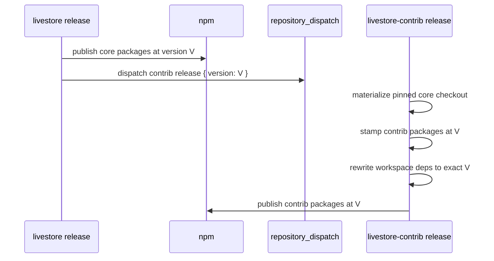

# Delivery — Spec

This document specifies how `livestorejs/livestore` and
`livestorejs/livestore-contrib` operate as one composed package family, and how
release artifacts (including the DevTools artifact) flow. It builds on
[requirements.md](./requirements.md).

## Status

Draft — the repository-composition and DevTools-artifact contracts below are
active.

## Scope

Defines:

- Package ownership between core and contrib.
- Megarepo composition and lock semantics.
- Development and publish-time dependency resolution.
- Shared tooling and CI composition.
- Release flow.
- Unified docs-site composition.
- Issue and pull-request routing.
- DevTools artifact release contract.

Does not define:

- Operational sequencing for repository changes.
- Internal architecture of individual packages (`02-system/`).
- Contributor governance or reviewer assignment policy (`05-contributing/`).
- Docs-site content rules (`04-docs/`).

Companion runbooks pending migration into this node:
`contributor-docs/package-release.md`, `contributor-docs/release-workflows.md`,
`contributor-docs/dependency-management.md`,
`contributor-docs/wa-sqlite-management.md` (tracked in
[DELTA-001](../.delta/DELTA-001-legacy-intent-surfaces.md)).

## Repository Topology

```
livestorejs/livestore                         livestorejs/livestore-contrib
core source of truth                          contrib source of truth

packages/@livestore/*                         packages/@livestore/*
docs/                                         examples/
megarepo.lock                                 megarepo.lock
  effect-utils  pinned                          effect-utils  pinned
  effect        unpinned                        effect        unpinned
  livestore-contrib unpinned                    livestore     pinned
repos/                                        repos/
  livestore-contrib -> store                    livestore -> store
```

The graph is intentionally asymmetric:

| Edge            |  Pinning | Purpose                                          |
| --------------- | -------: | ------------------------------------------------ |
| contrib -> core |   pinned | deterministic contrib development and CI         |
| core -> contrib | unpinned | docs build reads current contrib package sources |

Core never needs to update contrib's core pin, and contrib never needs to bump
core's unpinned contrib reference. This satisfies LS.DEL-R07–R09.

## Package Ownership

| Package               | Owner   | Reason                                                    |
| --------------------- | ------- | --------------------------------------------------------- |
| `livestore`           | core    | Engine root                                               |
| `common`              | core    | Engine internals                                          |
| `common-cf`           | core    | Cloudflare engine internals                               |
| `utils`               | core    | Shared utility surface                                    |
| `utils-dev`           | core    | Shared test infrastructure                                |
| `peer-deps`           | core    | Catalog management                                        |
| `react`               | core    | Primary framework integration                             |
| `adapter-web`         | core    | Primary browser adapter                                   |
| `adapter-cloudflare`  | core    | Primary production adapter                                |
| `sync-cf`             | core    | Primary sync provider                                     |
| `sqlite-wasm`         | core    | SQLite browser surface                                    |
| `wa-sqlite`           | core    | Vendored SQLite                                           |
| `webmesh`             | core    | Cross-worker mesh primitive                               |
| `framework-toolkit`   | core    | Shared primitive imported by React and contrib frameworks |
| `svelte`              | contrib | Framework integration                                     |
| `solid`               | contrib | Framework integration                                     |
| `adapter-node`        | contrib | Node platform adapter                                     |
| `adapter-expo`        | contrib | Expo platform adapter                                     |
| `devtools-expo`       | contrib | Expo devtools surface                                     |
| `sync-electric`       | contrib | Additional sync provider                                  |
| `sync-s2`             | contrib | Additional sync provider                                  |
| `graphql`             | contrib | Optional integration                                      |
| `cli`                 | contrib | Scaffolding and MCP server                                |

`@livestore/effect-playwright` is not part of either repository's final
LiveStore package set; it belongs in `overengineeringstudio/effect-utils`.

## Development Dependency Resolution

Contrib's root workspace includes both local contrib packages and materialized
core packages:

```yaml
packages:
  - packages/@livestore/*
  - repos/livestore/packages/@livestore/*
  - repos/livestore/packages/@local/*
```

A contrib package can declare:

```json
{
  "dependencies": {
    "@livestore/framework-toolkit": "workspace:*",
    "@livestore/livestore": "workspace:*"
  }
}
```

After `mr fetch --apply` and `pnpm install`, pnpm resolves those dependencies
as `link:` entries into `repos/livestore/...`. The install must run against a
writable materialized checkout because pnpm may write `node_modules` into
workspace package directories.

The live root workspace disables injected workspace package snapshots:

```yaml
injectWorkspacePackages: false
enableGlobalVirtualStore: true
storeDir: .devenv/pnpm-store-pure-v1
```

Generated package-closure projections may still use injected snapshots for
Nix/FOD dependency preparation. The distinction prevents duplicate LiveStore
package identities in the live TypeScript workspace while preserving prepared
dependency determinism.

## Publish-Time Dependency Resolution

Contrib release manifests replace `workspace:*` dependencies on core packages
with the exact core version being published:

```json
{
  "dependencies": {
    "@livestore/framework-toolkit": "0.4.2",
    "@livestore/livestore": "0.4.2"
  }
}
```

No contrib package publishes a range dependency on a core package. Exact
versions make a published release graph deterministic for users.

## Release Flow



Manual contrib release dispatch accepts an explicit version but must use a
version already published by core.

## Tooling Composition

Contrib's generated files are composed from the same helper stack as core, but
contrib owns its package and example membership locally. Core exports core
package metadata and reusable generator helpers; it does not carry the final
contrib package manifest.

| Surface           | Source of truth                                                        |
| ----------------- | ---------------------------------------------------------------------- |
| devenv            | effect-utils modules, imported by contrib                              |
| pnpm workspace    | contrib-local package/example manifest plus core/effect-utils helpers  |
| package manifests | contrib-local package manifest plus core/effect-utils helpers          |
| tsconfig          | contrib-local workspace shape plus core/effect-utils helpers           |
| oxlint/oxfmt      | effect-utils base config plus contrib-local ignores                    |
| labels/settings   | effect-utils catalog plus contrib-local labels                         |
| CI workflow       | effect-utils workflow builders plus core re-exported setup atoms       |

Contrib's `genie/repo.ts` imports core helpers by relative path:

```ts
export * from '../repos/livestore/genie/repo.ts'
```

It does not import `#mr/livestore/...`; that resolver form is scoped to the
file's own megarepo root and fails for nested cross-repo composition.

Contrib CI composes setup atoms with contrib-specific identifiers:

```ts
installNixStep(...)
applyMegarepoLockStep(...)
restorePnpmStateStep({ keyPrefix: 'livestore-contrib-pnpm-state-v1' })
cachixStep({ name: 'livestore-contrib', ... })
```

It does not reuse `livestoreSetupSteps` wholesale because that composite
carries core-specific cache names and pnpm state keys.

## Docs Site Composition

Core owns `docs.livestore.dev`. The docs build materializes contrib before
reading contrib package source:

```bash
mr fetch --only livestore-contrib --apply
```

TypeDoc entry points can then include both core and contrib paths:

```ts
starlightTypeDoc({
  entryPoints: [
    'packages/@livestore/react/src/index.ts',
    'repos/livestore-contrib/packages/@livestore/svelte/src/index.ts',
    'repos/livestore-contrib/packages/@livestore/sync-electric/src/index.ts',
  ],
})
```

During the interim architecture, contrib package docs content may remain in
the core docs tree while source entry points read contrib packages. A later
docs source ownership pass can move package-specific docs into contrib without
changing the public docs URL.

## Issue And Pull-Request Routing

| Concern                                                                  | Repository                                                           |
| ------------------------------------------------------------------------ | -------------------------------------------------------------------- |
| Core engine, React, web adapter, Cloudflare adapter, Cloudflare sync     | `livestorejs/livestore`                                              |
| Svelte, Solid, Node, Expo, Electric, S2, GraphQL, CLI, contrib devtools  | `livestorejs/livestore-contrib`                                      |
| Docs site infrastructure                                                 | `livestorejs/livestore`                                              |
| Package-specific docs content                                            | owning package repository once docs source ownership is implemented  |
| Cross-repo release/version coordination                                  | `livestorejs/livestore` coordination issue                           |

The package ownership table is the routing source of truth.

## History Preservation

Contrib package directories preserve relevant core history through filtered
history import. The imported history must exclude `framework-toolkit`, because
that package remains core-owned. The import records the source core commit
used for the move so future archaeology can cross-reference both repositories.

## DevTools Artifact Release

LiveStore releases consume a prebuilt DevTools artifact produced from `overeng`
source. Protocol semantics live in `02-system/07-devtools/`; this section owns
only the artifact release contract. Constrained by the workflow documentation
in [../../.github/workflows/README.md](../../.github/workflows/README.md).

### Release Boundary

```
overeng source
  -> DevTools artifact producer
  -> immutable public artifact
  -> release/devtools-artifact.json
  -> LiveStore release CI
  -> @livestore/devtools-vite + Chrome ZIP repack
```

`overeng` owns DevTools source and artifact production. LiveStore owns the
release decision for artifacts shipped under LiveStore versions.

The checked-in artifact pointer is long-lived state. Compatibility proof is
release-candidate state.

### Cadence Invariant

LiveStore releases must not require `overeng` work when the selected DevTools
artifact is still compatible.

This invariant is intentional because LiveStore releases happen more often
than DevTools releases. A normal LiveStore release should download the pinned
artifact, verify its integrity, run release-candidate compatibility checks,
and publish the repacked DevTools package if those checks pass.

`overeng` is required only when:

- DevTools source changes
- the selected artifact fails LiveStore release-candidate compatibility checks
- the artifact metadata or packaging contract changes
- a coupled LiveStore and DevTools protocol change is intentional

### Release Scenarios

| Scenario                                  | Requires `overeng`? | Expected behavior                                                                                                 |
| ----------------------------------------- | ------------------- | ------------------------------------------------------------------------------------------------------------------ |
| LiveStore release with unchanged DevTools | No                  | LiveStore CI re-verifies the pinned artifact against the release candidate.                                        |
| LiveStore patch release                   | No                  | The pinned artifact is reused if the compatibility gate passes.                                                    |
| DevTools-only artifact refresh            | Yes                 | `overeng` builds and publishes a new immutable artifact, then LiveStore reviews the manifest update.               |
| Coupled LiveStore and DevTools change     | Yes                 | A new artifact is produced for the LiveStore change and LiveStore CI verifies that exact pairing.                  |
| Existing artifact fails compatibility     | Usually yes         | Release blocks until LiveStore preserves compatibility or a new DevTools artifact is produced.                     |
| CI snapshot release                       | No                  | Snapshot repack may use ephemeral CI certification because snapshot versions cannot be checked in ahead of time.   |

### Certification Model

The release model does not store LiveStore-version-specific certification as
durable repository state.

Durable state:

```json
{
  "artifact": {
    "metadataUrl": "...",
    "tarballUrl": "...",
    "sha256": "...",
    "chromeZipUrl": "...",
    "chromeZipSha256": "..."
  }
}
```

Ephemeral CI proof:

```json
{
  "livestoreVersion": "0.4.0-dev.27",
  "devtoolsBuildId": "dt-...",
  "devtoolsProtocolVersion": 1,
  "scenarios": ["node adapter session loads through Vite and stays connected past 35 seconds"],
  "ciRunUrl": "https://github.com/livestorejs/livestore/actions/runs/..."
}
```

Release publish should depend on the CI proof for the release candidate, not
on manual certification text committed to the manifest.

### Compatibility Gate

LiveStore release CI must verify:

- artifact checksums match the manifest
- metadata declares a supported DevTools protocol version
- repacked package shape is valid
- the artifact does not leak source, sourcemaps, credentials, or local paths
- node adapter direct-route liveness survives the heartbeat window

The release artifact liveness scenario must use the exact downloaded artifact,
not a local workspace build. The Node adapter scenario must replace every
workspace `@livestore/devtools-vite` resolution path used by the fixture,
including the transitive package under `@livestore/adapter-node`; replacing
only the test package's top-level `node_modules` entry is not sufficient
proof.

Direct web session liveness is still required in the normal Playwright
DevTools suite, but it is not claimed as exact-artifact release proof because
it does not exercise the repacked `@livestore/devtools-vite` artifact selected
by the LiveStore manifest.

The liveness scenario must also be independent of developer-machine sponsor
activation state. Public DevTools artifacts enforce the sponsor/license gate
by default, but release certification runs with the explicit
`LIVESTORE_DEVTOOLS_ENFORCE_LICENSE=false` test override so CI verifies
connectivity and protocol compatibility rather than a maintainer's local
license cache.

### Simplification

The durable state is intentionally limited to immutable artifact identity:

1. keep only immutable artifact identity in `release/devtools-artifact.json`
2. run compatibility certification during LiveStore release validation
3. publish only from the same release candidate that passed certification
4. require `overeng` only to produce or replace artifacts

This preserves the original safety property without making every LiveStore
release a DevTools release.

### Documentation Contract

LiveStore docs must document consumer behavior and release scenarios.

`overeng` docs must document producer behavior:

- how DevTools artifacts are built
- how artifact metadata is generated
- how artifact checksums are produced
- how a LiveStore manifest update is requested
- how to debug producer-side certification failures

Docs must be updated whenever the release boundary, artifact schema, or
required compatibility scenarios change.

## Open Design Questions

- **LS.DEL-DQ1 TypeDoc project resolution:** Verify TypeDoc project-reference
  resolution through `repos/livestore-contrib` during the docs build.
- **LS.DEL-DQ2 First contrib release proof:** Exercise the contrib release
  workflow with a dry-run or controlled first release before relying on it for
  routine releases.
- **LS.DEL-DQ3 Docs source ownership:** Decide the eventual mechanism for
  contrib-owned docs content mounted into the core docs site.
