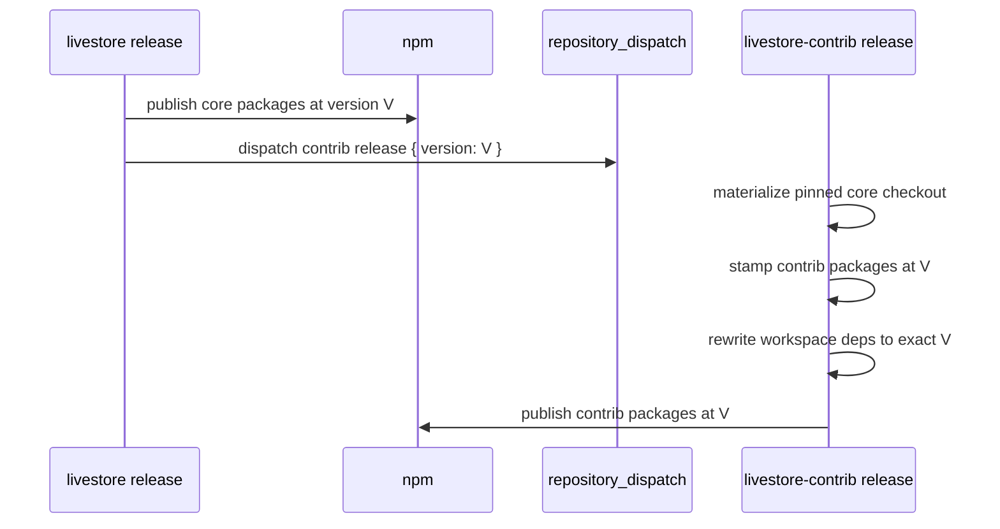

# Core/contrib repository architecture — Spec

This document specifies how `livestorejs/livestore` and
`livestorejs/livestore-contrib` operate as one composed package family. It
builds on [requirements.md](./requirements.md).

## Status

Draft — active architecture contract.

## Scope

Defines:

- Package ownership between core and contrib.
- Megarepo composition and lock semantics.
- Development and publish-time dependency resolution.
- Shared tooling and CI composition.
- Release flow.
- Unified docs-site composition.
- Issue and pull-request routing.

Does not define:

- Operational sequencing for repository changes.
- Internal architecture of individual packages.
- Contributor governance or reviewer assignment policy.

## Repository Topology

```
livestorejs/livestore                         livestorejs/livestore-contrib
core source of truth                          contrib source of truth

packages/@livestore/*                         packages/@livestore/*
docs/                                         examples/
megarepo.lock                                 megarepo.lock
  effect-utils  pinned                          effect-utils  pinned
  effect        unpinned                        effect        unpinned
  livestore-contrib unpinned                    livestore     pinned
repos/                                        repos/
  livestore-contrib -> store                    livestore -> store
```

The graph is intentionally asymmetric:

| Edge            |  Pinning | Purpose                                          |
| --------------- | -------: | ------------------------------------------------ |
| contrib -> core |   pinned | deterministic contrib development and CI         |
| core -> contrib | unpinned | docs build reads current contrib package sources |

Core never needs to update contrib's core pin, and contrib never needs to bump
core's unpinned contrib reference. This satisfies R07-R09.

## Package Ownership

| Package               | Owner   | Reason                                                    |
| --------------------- | ------- | --------------------------------------------------------- |
| `livestore`           | core    | Engine root                                               |
| `common`              | core    | Engine internals                                          |
| `common-cf`           | core    | Cloudflare engine internals                               |
| `utils`               | core    | Shared utility surface                                    |
| `utils-dev`           | core    | Shared test infrastructure                                |
| `peer-deps`           | core    | Catalog management                                        |
| `react`               | core    | Primary framework integration                             |
| `adapter-web`         | core    | Primary browser adapter                                   |
| `adapter-cloudflare`  | core    | Primary production adapter                                |
| `sync-cf`             | core    | Primary sync provider                                     |
| `sqlite-wasm`         | core    | SQLite browser surface                                    |
| `wa-sqlite`           | core    | Vendored SQLite                                           |
| `webmesh`             | core    | Cross-worker mesh primitive                               |
| `framework-toolkit`   | core    | Shared primitive imported by React and contrib frameworks |
| `svelte`              | contrib | Framework integration                                     |
| `solid`               | contrib | Framework integration                                     |
| `adapter-node`        | contrib | Node platform adapter                                     |
| `adapter-expo`        | contrib | Expo platform adapter                                     |
| `devtools-expo`       | contrib | Expo devtools surface                                     |
| `sync-electric`       | contrib | Additional sync provider                                  |
| `sync-s2`             | contrib | Additional sync provider                                  |
| `graphql`             | contrib | Optional integration                                      |
| `cli`                 | contrib | Scaffolding and MCP server                                |

`@livestore/effect-playwright` is not part of either repository's final
LiveStore package set; it belongs in `overengineeringstudio/effect-utils`.

## Development Dependency Resolution

Contrib's root workspace includes both local contrib packages and materialized
core packages:

```yaml
packages:
  - packages/@livestore/*
  - repos/livestore/packages/@livestore/*
  - repos/livestore/packages/@local/*
```

A contrib package can declare:

```json
{
  "dependencies": {
    "@livestore/framework-toolkit": "workspace:*",
    "@livestore/livestore": "workspace:*"
  }
}
```

After `mr fetch --apply` and `pnpm install`, pnpm resolves those dependencies
as `link:` entries into `repos/livestore/...`. The install must run against a
writable materialized checkout because pnpm may write `node_modules` into
workspace package directories.

The live root workspace disables injected workspace package snapshots:

```yaml
injectWorkspacePackages: false
enableGlobalVirtualStore: true
storeDir: .devenv/pnpm-store-pure-v1
```

Generated package-closure projections may still use injected snapshots for
Nix/FOD dependency preparation. The distinction prevents duplicate LiveStore
package identities in the live TypeScript workspace while preserving prepared
dependency determinism.

## Publish-Time Dependency Resolution

Contrib release manifests replace `workspace:*` dependencies on core packages
with the exact core version being published:

```json
{
  "dependencies": {
    "@livestore/framework-toolkit": "0.4.2",
    "@livestore/livestore": "0.4.2"
  }
}
```

No contrib package publishes a range dependency on a core package. Exact
versions make a published release graph deterministic for users.

## Release Flow



Manual contrib release dispatch accepts an explicit version but must use a
version already published by core.

## Tooling Composition

Contrib's generated files are composed from the same helper stack as core, but
contrib owns its package and example membership locally. Core exports core
package metadata and reusable generator helpers; it does not carry the final
contrib package manifest.

| Surface           | Source of truth                                                  |
| ----------------- | ---------------------------------------------------------------- |
| devenv            | effect-utils modules, imported by contrib                        |
| pnpm workspace    | contrib-local package/example manifest plus core/effect-utils helpers |
| package manifests | contrib-local package manifest plus core/effect-utils helpers     |
| tsconfig          | contrib-local workspace shape plus core/effect-utils helpers      |
| oxlint/oxfmt      | effect-utils base config plus contrib-local ignores              |
| labels/settings   | effect-utils catalog plus contrib-local labels                   |
| CI workflow       | effect-utils workflow builders plus core re-exported setup atoms |

Contrib's `genie/repo.ts` imports core helpers by relative path:

```ts
export * from '../repos/livestore/genie/repo.ts'
```

It does not import `#mr/livestore/...`; that resolver form is scoped to the
file's own megarepo root and fails for nested cross-repo composition.

Contrib CI composes setup atoms with contrib-specific identifiers:

```ts
installNixStep(...)
applyMegarepoLockStep(...)
restorePnpmStateStep({ keyPrefix: 'livestore-contrib-pnpm-state-v1' })
cachixStep({ name: 'livestore-contrib', ... })
```

It does not reuse `livestoreSetupSteps` wholesale because that composite carries
core-specific cache names and pnpm state keys.

## Docs Site Composition

Core owns `docs.livestore.dev`. The docs build materializes contrib before
reading contrib package source:

```bash
mr fetch --only livestore-contrib --apply
```

TypeDoc entry points can then include both core and contrib paths:

```ts
starlightTypeDoc({
  entryPoints: [
    'packages/@livestore/react/src/index.ts',
    'repos/livestore-contrib/packages/@livestore/svelte/src/index.ts',
    'repos/livestore-contrib/packages/@livestore/sync-electric/src/index.ts',
  ],
})
```

During the interim architecture, contrib package docs content may remain in the
core docs tree while source entry points read contrib packages. A later docs
source ownership pass can move package-specific docs into contrib without
changing the public docs URL.

## Issue And Pull-Request Routing

| Concern                                                                 | Repository                                                          |
| ----------------------------------------------------------------------- | ------------------------------------------------------------------- |
| Core engine, React, web adapter, Cloudflare adapter, Cloudflare sync    | `livestorejs/livestore`                                             |
| Svelte, Solid, Node, Expo, Electric, S2, GraphQL, CLI, contrib devtools | `livestorejs/livestore-contrib`                                     |
| Docs site infrastructure                                                | `livestorejs/livestore`                                             |
| Package-specific docs content                                           | owning package repository once docs source ownership is implemented |
| Cross-repo release/version coordination                                 | `livestorejs/livestore` coordination issue                          |

The package ownership table is the routing source of truth.

## History Preservation

Contrib package directories preserve relevant core history through filtered
history import. The imported history must exclude `framework-toolkit`, because
that package remains core-owned. The import records the source core commit used
for the move so future archaeology can cross-reference both repositories.

## Open Design Questions

- **DQ1 TypeDoc project resolution:** Verify TypeDoc project-reference
  resolution through `repos/livestore-contrib` during the docs build.
- **DQ2 First contrib release proof:** Exercise the contrib release workflow
  with a dry-run or controlled first release before relying on it for routine
  releases.
- **DQ3 Docs source ownership:** Decide the eventual mechanism for contrib-owned
  docs content mounted into the core docs site.
