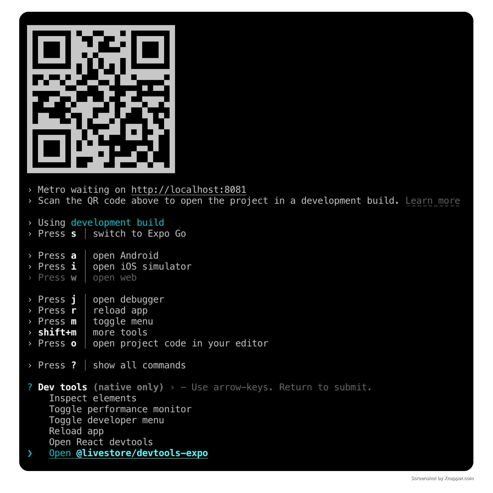
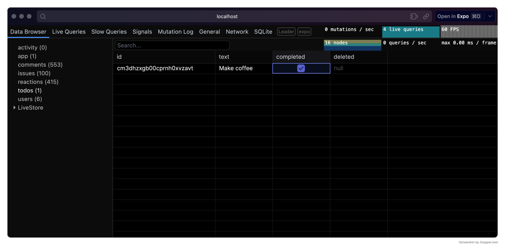

import { Code, Steps, Tabs, TabItem } from '@astrojs/starlight/components'
import { makeCreate, versionNpmSuffix } from '../../../data/data.ts'
import { MIN_NODE_VERSION } from '@local/shared'
import babelConfigCode from '../../../../../examples/expo-todomvc-sync-cf/babel.config.js?raw'
import metroConfigCode from '../../../../../examples/expo-todomvc-sync-cf/metro.config.js?raw'
import SchemaSnippet from '../../_assets/code/getting-started/expo/livestore/schema.ts?snippet'
import StoreSnippet from '../../_assets/code/getting-started/expo/livestore/store.ts?snippet'
import RootSnippet from '../../_assets/code/getting-started/expo/Root.tsx?snippet'
import NewTodoSnippet from '../../_assets/code/getting-started/expo/components/NewTodo.tsx?snippet'
import ListTodosSnippet from '../../_assets/code/getting-started/expo/components/ListTodos.tsx?snippet'

export const CODE = {
  babelConfig: babelConfigCode,
  metroConfig: metroConfigCode,
}

export const SNIPPETS = {
  schema: SchemaSnippet,
  store: StoreSnippet,
  root: RootSnippet,
  newTodo: NewTodoSnippet,
  listTodos: ListTodosSnippet,
}

{/* We're adjusting the package to use the dev version on the dev branch */}
export const manualInstallDepsStr = [
  '@livestore/devtools-expo' + versionNpmSuffix,
  '@livestore/adapter-expo' + versionNpmSuffix,
  '@livestore/livestore' + versionNpmSuffix,
  '@livestore/react' + versionNpmSuffix,
  '@livestore/sync-cf/client' + versionNpmSuffix,
  '@livestore/peer-deps' + versionNpmSuffix,
  'expo-sqlite',
].join(' ')

### Prerequisites

- Recommended: Bun 1.2 or higher
- Node.js {MIN_NODE_VERSION} or higher

To use [LiveStore](/) with [Expo](https://docs.expo.dev/), ensure your project has the [New Architecture](https://docs.expo.dev/guides/new-architecture/) enabled. This is required for transactional state updates.

### Option A: Quick start

For a quick start we recommend using our template app following the steps below.

For existing projects see [Existing project setup](#existing-project-setup).

<Steps>

1.  **Set up project from template**

    <Tabs syncKey="package-manager">
      <TabItem label="bun">
        <Code code={makeCreate('expo-todomvc-sync-cf', 'bunx')} lang="sh" />
      </TabItem>
      <TabItem label="pnpm">
        <Code code={makeCreate('expo-todomvc-sync-cf', 'pnpm dlx')} lang="sh" />
      </TabItem>
      <TabItem label="npm">
        <Code code={makeCreate('expo-todomvc-sync-cf', 'npx')} lang="sh" />
      </TabItem>
      <TabItem label="yarn">
        <Code code={makeCreate('expo-todomvc-sync-cf', 'yarn dlx')} lang="sh" />
      </TabItem>
    </Tabs>

    Replace `livestore-app` with your desired app name.

2.  **Install dependencies**

    It's strongly recommended to use `bun` or `pnpm` for the simplest and most reliable dependency setup (see [note on package management](/misc/package-management) for more details).

    <Tabs syncKey="package-manager">
      <TabItem label="bun">
        ```bash
        bun install
        ```
      </TabItem>
      <TabItem label="pnpm">
        ```bash
        pnpm install --node-linker=hoisted
        ```

        Make sure to use `--node-linker=hoisted` when installing dependencies in your project or add it to your `.npmrc` file.
        ```
        # .npmrc
        nodeLinker=hoisted
        ```

        Hopefully Expo will also support non-hoisted setups in the future.
      </TabItem>
      <TabItem label="npm">
        ```bash
        npm install
        ```
      </TabItem>
      <TabItem label="yarn">
        When using `yarn`, make sure you're using Yarn 4 or higher with the `node-modules` linker.

        ```bash
        yarn set version stable
        yarn config set nodeLinker node-modules
        yarn install
        ```
      </TabItem>
    </Tabs>

    Pro tip: You can use [direnv](https://direnv.net/) to manage environment variables.

3.  **Run the app**

    <Tabs syncKey="package-manager">
      <TabItem label="bun">
        <Code code="bun start" lang="sh" />
      </TabItem>
      <TabItem label="pnpm">
        <Code code="pnpm start" lang="sh" />
      </TabItem>
      <TabItem label="npm">
        <Code code="npm run start" lang="sh" />
      </TabItem>
      <TabItem label="yarn">
        <Code code="yarn start" lang="sh" />
      </TabItem>
    </Tabs>

    In a new terminal, start the Cloudflare Worker (for the sync backend):

    <Tabs syncKey="package-manager">
      <TabItem label="bun">
        <Code code="bun wrangler:dev" lang="sh" />
      </TabItem>
      <TabItem label="pnpm">
        <Code code="pnpm wrangler:dev" lang="sh" />
      </TabItem>
      <TabItem label="npm">
        <Code code="npm run wrangler:dev" lang="sh" />
      </TabItem>
      <TabItem label="yarn">
        <Code code="yarn wrangler:dev" lang="sh" />
      </TabItem>
    </Tabs>
</Steps>

### Option B: Existing project setup \{#existing-project-setup\}

<Steps>

1.  **Install dependencies**

    <Tabs syncKey="package-manager">
      <TabItem label="bun">
        <Code code={'bun install ' + manualInstallDepsStr} lang="sh" />
      </TabItem>
      <TabItem label="pnpm">
        <Code code={'pnpm install ' + manualInstallDepsStr} lang="sh" />
      </TabItem>
      <TabItem label="npm">
        <Code code={'npm install ' + manualInstallDepsStr} lang="sh" />
      </TabItem>
      <TabItem label="yarn">
        <Code code={'yarn add ' + manualInstallDepsStr} lang="sh" />
      </TabItem>
    </Tabs>

2.  **Add Vite meta plugin to babel config file**

    LiveStore Devtools uses Vite. This plugin emulates Vite's `import.meta.env` functionality.

    <Tabs syncKey="package-manager">
      <TabItem label="bun">
        <Code code="bun add -d babel-plugin-transform-vite-meta-env" lang="sh" />
      </TabItem>
      <TabItem label="pnpm">
        <Code code="pnpm add -D babel-plugin-transform-vite-meta-env" lang="sh" />
      </TabItem>
      <TabItem label="yarn">
        <Code code="yarn add -D babel-plugin-transform-vite-meta-env" lang="sh" />
      </TabItem>
      <TabItem label="npm">
        <Code code="npm install --save-dev babel-plugin-transform-vite-meta-env" lang="sh" />
      </TabItem>
    </Tabs>

    In your `babel.config.js` file, add the plugin as follows:

    <Code code={CODE.babelConfig} lang="js" title="babel.config.js" />

3.  **Update Metro config**

    Add the following code to your `metro.config.js` file:

    <Code code={CODE.metroConfig} lang="js" title="metro.config.js" />

</Steps>

## Define your schema

Create a file named `schema.ts` inside the `src/livestore` folder. This file defines your LiveStore schema consisting of your app's event definitions (describing how data changes), derived state (i.e. SQLite tables), and materializers (how state is derived from events).

Here's an example schema:

<SNIPPETS.schema />

## Configure the store

Create a `store.ts` file in the `src/livestore` folder. This file configures the store adapter and exports a custom hook that components will use to access the store.

The `useStore()` hook accepts store configuration options (schema, adapter, store ID) and returns a store instance. It suspends while the store is loading, so make sure to use a `Suspense` boundary to handle the loading state.

<SNIPPETS.store />

## Set up the store registry

To enable store management throughout your app, create a `StoreRegistry` and provide it with a `<StoreRegistryProvider>`. The registry manages store instance lifecycles (loading, caching, disposal).

Wrap the provider in a `Suspense` boundary to handle the loading state for when the store is loading.

<SNIPPETS.root />

## Commit events

After setting up the registry, use the `useAppStore()` hook from any component to access the store and commit events.

<SNIPPETS.newTodo />

## Queries

To retrieve data from the database, define a query using `queryDb` from `@livestore/livestore`, then execute it with `store.useQuery()`.

Consider abstracting queries into a separate file to keep your code organized, though you can also define them directly within components if preferred.

<SNIPPETS.listTodos />

## Devtools

To open the devtools, run the app and from your terminal press `shift + m`, then select LiveStore Devtools and press `Enter`.



This will open the devtools in a new tab in your default browser.



Use the devtools to inspect the state of your LiveStore database, execute events, track performance, and more.

## Database location

### With Expo Go

To open the database in Finder, run the following command in your terminal:

```bash
open $(find $(xcrun simctl get_app_container booted host.exp.Exponent data) -path "*/Documents/ExponentExperienceData/*livestore-expo*" -print -quit)/SQLite
```

### With development builds

For development builds, the app SQLite database is stored in the app's Library directory.

Example:
`/Users/<USERNAME>/Library/Developer/CoreSimulator/Devices/<DEVICE_ID>/data/Containers/Data/Application/<APP_ID>/Documents/SQLite/app.db`

To open the database in Finder, run the following command in your terminal:

```bash
open $(xcrun simctl get_app_container booted [APP_BUNDLE_ID] data)/Documents/SQLite
```

Replace `[APP_BUNDLE_ID]` with your app's bundle ID. e.g. `dev.livestore.livestore-expo`.

## Further notes

- LiveStore doesn't yet support Expo Web (see [#130](https://github.com/livestorejs/livestore/issues/130))
