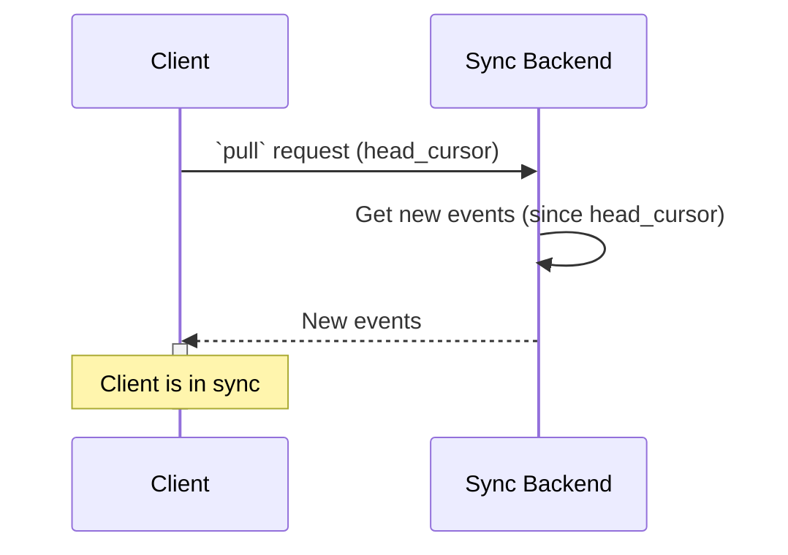
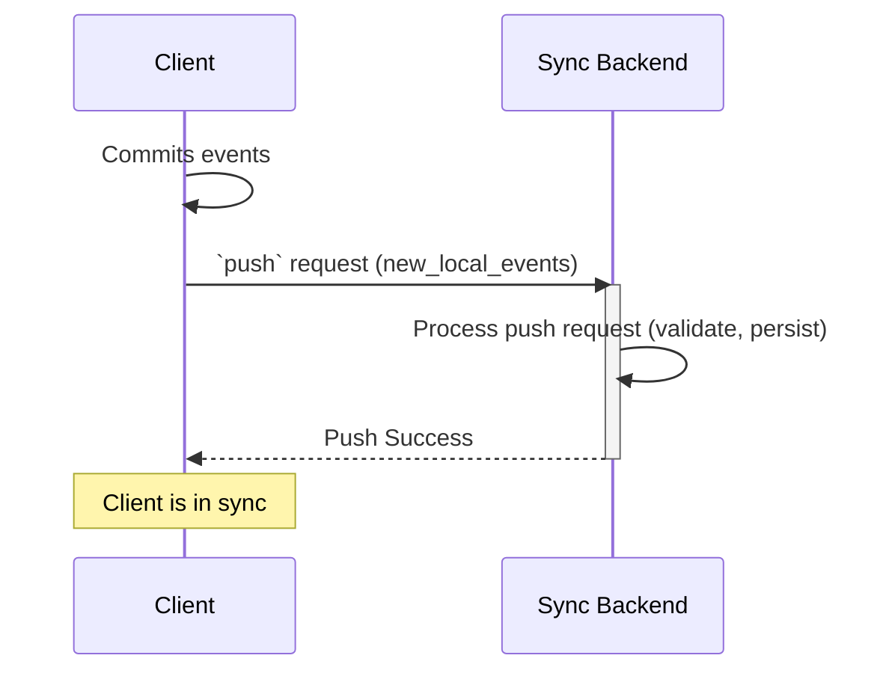

## How it works

LiveStore is based on [the idea of event-sourcing](/evaluation/event-sourcing) which means it syncs events across clients (via a central sync backend) and then materializes the events in the local SQLite database. This means LiveStore isn't syncing the SQLite database itself directly but only the events that are used to materialize the database making sure it's kept in sync across clients.

The syncing mechanism is similar to how Git works in that regard that it's based on a "push/pull" model. Upstream events always need to be pulled before a client can push its own events to preserve a [global total order of events](https://medium.com/baseds/ordering-distributed-events-29c1dd9d1eff). Local pending events which haven't been pushed yet need to be rebased on top of the latest upstream events before they can be pushed.

<iframe src='https://www.tldraw.com/p/CWLjWxk0On_rAtjsJ4vt2?d=v-480.-234.2966.2441.RaypXEQgx30bxQnCcVFAG' style={{ height: '400px', width: '100%' }} />

## Events

A LiveStore event consists of the following data:
- `seqNum`: event sequence number
- `parentSeqNum`: parent event sequence number
- `name`: event name (refers to a event definition in the schema)
- `args`: event arguments (encoded using the event's schema definition, usually JSON)

### Event sequence numbers

- Event sequence numbers: monotonically increasing integers
  - client event sequence number to sync across client sessions (never exposed to the sync backend)

### Sync heads

- The latest event in a eventlog is referred to as the "head" (similar to how Git refers to the latest commit as the "head").
- Given that LiveStore does hierarchical syncing between the client session, the client leader and the sync backend, there are three heads (i.e. the client session head, the client leader head, and the sync backend head).

## Sync backend

The sync backend acts as the global authority and determines the total order of events ("causality"). It's responsible for storing and querying events and for notifying clients when new events are available.

### Requirements for sync backend

- Needs to provide an efficient way to query an ordered list of events given a starting event ID (often referred to as cursor).
- Ideally provides a "reactivity" mechanism to notify clients when new events are available (e.g. via WebSocket, HTTP long-polling, etc).
  - Alternatively, the client can periodically query for new events which is less efficient.

## Clients

- Each client initialy chooses a random `clientId` as its globally unique ID
  - LiveStore uses a 6-char nanoid
	- In the unlikely event of a collision which is detected by the sync backend the first time a client tries to push, the client chooses a new random `clientId`, patches the local events with the new `clientId`, and tries again.

### Local syncing across client sessions

- For adapters which support multiple client sessions (e.g. web), LiveStore also supports local syncing across client sessions (e.g. across browser tabs or worker threads).
- LiveStore does this by electing a leader thread which is responsible for syncing and persiting data locally.
- Client session events are not synced to the sync backend.

## Auth (Authentication & Authorization)

- TODO
  - Provide basic example
  - Encryption

## Advanced

### Sequence diagrams

#### Pulling events (without unpushed events)

#### Pushing events

### Rebasing

### Merge conflicts

- Merge conflict handling isn't implemented yet (see [this issue](https://github.com/livestorejs/livestore/issues/253)).
- Merge conflict detection and resolution will be based on the upcoming [facts system functionality](https://github.com/livestorejs/livestore/issues/254).

### Compaction

- Compaction isn't implemented yet (see [this issue](https://github.com/livestorejs/livestore/issues/136))
- Compaction will be based on the upcoming [facts system functionality](https://github.com/livestorejs/livestore/issues/254).

### Partitioning

- Currently LiveStore assumes a 1:1 mapping between an eventlog and a SQLite database.
- In the future, LiveStore aims to support multiple eventlogs (see [this issue](https://github.com/livestorejs/livestore/issues/255)).

## Design decisions / trade-offs

- Require a central sync backend to enforce a global total order of events.
  - This means LiveStore can't be used in a fully decentralized/P2P manner.
- Do rebasing on the client side (instead of on the sync backend). This allows the user to have more control over the rebase process.

## Notes

- Rich text data is best handled via CRDTs (see [#263](https://github.com/livestorejs/livestore/issues/263))

## Further reading

- Distributed Systems lecture series by Martin Kleppmann: [YouTube playlist](https://www.youtube.com/playlist?list=PLeKd45zvjcDFUEv_ohr_HdUFe97RItdiB) / [lecture notes](https://www.cl.cam.ac.uk/teaching/2122/ConcDisSys/dist-sys-notes.pdf)