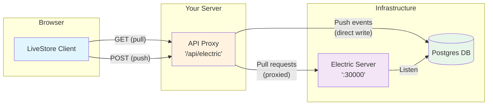

The `@livestore/sync-electric` package lets you sync LiveStore with ElectricSQL.

- Package: `pnpm add @livestore/sync-electric`
- Protocol: HTTP push/pull with long-polling support

## Architecture



The API proxy has dual responsibilities:
- **Push Events**: Writes events directly to Postgres tables (bypasses Electric)
- **Pull Requests**: Proxies to Electric server for reading events
- **Authentication**: Implements your custom auth logic
- **Database Management**: Initializes tables and manages connections

## Client Setup

Basic usage in your worker/server code:

```ts
import { makeSyncBackend } from '@livestore/sync-electric'

const backend = makeSyncBackend({
  endpoint: '/api/electric', // Your API proxy endpoint
  ping: { enabled: true },
})
```

## API Proxy Implementation

ElectricSQL requires an API proxy on your server to handle authentication and database operations. Your proxy needs two endpoints:

### Minimal Implementation Example

```ts
import { Schema } from '@livestore/livestore'
import { ApiSchema, makeElectricUrl } from '@livestore/sync-electric'

const electricHost = 'http://localhost:30000' // Your Electric server

// GET /api/electric - Pull events (proxied through Electric)
export async function GET(request: Request) {
  const searchParams = new URL(request.url).searchParams
  const { url, storeId, needsInit } = makeElectricUrl({
    electricHost,
    searchParams,
    apiSecret: 'your-electric-secret',
  })
  
  // Add your authentication logic here
  // if (!isAuthenticated(request)) {
  //   return new Response('Unauthorized', { status: 401 })
  // }
  
  // Initialize database tables if needed
  if (needsInit) {
    const db = makeDb(storeId)
    await db.migrate()
    await db.disconnect()
  }
  
  // Proxy pull request to Electric server for reading
  return fetch(url)
}

// POST /api/electric - Push events (direct database write)
export async function POST(request: Request) {
  const payload = await request.json()
  const parsed = Schema.decodeUnknownSync(ApiSchema.PushPayload)(payload)
  
  // Write events directly to Postgres table (bypasses Electric)
  const db = makeDb(parsed.storeId)
  await db.createEvents(parsed.batch)
  await db.disconnect()
  
  return Response.json({ success: true })
}
```

### Important Considerations

- **Database Setup**: Ensure your Postgres database is configured for Electric
- **Authentication**: Implement proper auth checks in your proxy
- **Error Handling**: Add robust error handling for database operations
- **Connection Management**: Properly manage database connections

## Example

See the
[todomvc-sync-electric](https://github.com/livestorejs/livestore/tree/main/examples/web-todomvc-sync-electric)
example for a complete implementation.

## How the sync provider works

The initial version of the ElectricSQL sync provider will use the server-side
Postgres DB as a store for the mutation event history.

Events are stored in a table following the pattern
`eventlog_${PERSISTENCE_FORMAT_VERSION}_${storeId}` where
`PERSISTENCE_FORMAT_VERSION` is a number that is incremented whenever the
`sync-electric` internal storage format changes.

## F.A.Q.

### Can I use my existing Postgres database with the sync provider?

Unless the database is already modelled as a eventlog following the
`@livestore/sync-electric` storage format, you won't be able to easily use your
existing database with this sync backend implementation.

We might support this use case in the future, you can follow the progress
[here](https://github.com/livestorejs/livestore/issues/286). Please share any
feedback you have on this use case there.

### Why do I need an API proxy in front of the ElectricSQL server?

The API proxy is used to handle pull/push requests between LiveStore and ElectricSQL,
allowing you to implement custom logic such as:
- Authentication and authorization
- Rate limiting and quota management
- Database initialization and migration
- Custom business logic and validation
