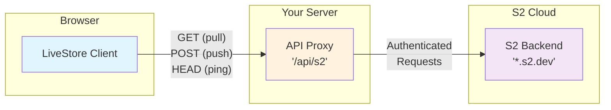

import { Code } from '@astrojs/starlight/components';
import ClientSetupSnippet from '../../../../_assets/code/reference/syncing/s2/client-setup.ts?snippet';
import ApiProxyImplementationSnippet from '../../../../_assets/code/reference/syncing/s2/api-proxy-implementation.ts?snippet';
import recordStructureExampleCode from '../../../../_assets/code/reference/syncing/s2/record-structure.json?raw';

export const SNIPPETS = {
  clientSetup: ClientSetupSnippet,
  apiProxyImplementation: ApiProxyImplementationSnippet,
};

export const CODE = {
  recordStructureExample: recordStructureExampleCode,
};

The `@livestore/sync-s2` package lets you sync LiveStore with the official S2 backend (s2.dev).

- Package: `pnpm add @livestore/sync-s2`
- Protocol: HTTP push/pull, live pull via SSE

## Architecture

The API proxy handles:
- **Business logic**: Any kind of business logic that is specific to your application (e.g. rate limiting, auth, logging, etc.)
- **S2 Stream Management**: Creates basins and streams as needed
- **S2 Request Translation**: Converts LiveStore sync operations to authenticated S2 API calls

## Client Setup

Basic usage in your worker/server code:

<SNIPPETS.clientSetup />

## API Proxy Implementation

S2 requires authentication and stream management that can't be handled directly from the browser. You'll need to implement an API proxy on your server that:

1. **Handles authentication** with S2 using your access token
2. **Manages basins and streams** (creates them if they don't exist)
3. **Proxies requests** between LiveStore and S2

Your proxy needs three endpoints:

### Using Helper Functions

The `@livestore/sync-s2` package provides helper functions to simplify the proxy implementation:

<SNIPPETS.apiProxyImplementation />

### Cursor Semantics

The S2 sync provider uses a cursor that represents the **last processed record**:
- The cursor points to the last S2 sequence number we've seen
- S2's `seq_num` parameter expects where to start reading from (inclusive)
- The helper functions automatically handle the `+1` conversion: `seq_num = cursor + 1`
- When starting from the beginning, cursor is `'from-start'` which maps to `seq_num = 0`

### Important Considerations

- **Stream provisioning**: The helper functions provide `ensureBasin()` and `ensureStream()` to handle creation automatically.
- **Error handling**: The helpers include fallback responses (`emptyBatchResponse()`, `sseKeepAliveResponse()`) to maintain stream continuity during errors.
- **Authentication**: Store your S2 access token securely (e.g., environment variables).
- **Rate limiting**: Consider implementing rate limiting to protect your S2 quota.
- **Response helpers**: Use the provided response helpers (`successResponse()`, `errorResponse()`) for consistent API responses.

## Live Pull (SSE)

S2 provider supports live pulls over Server-Sent Events (SSE). When `live: true` is passed to `pull`, the client:
- Immediately emits one page (possibly empty) with `pageInfo: NoMore`.
- Parses SSE frames robustly (multi-line `data:` support) and reacts to typed events:
  - `event: batch` → parses `data` as S2 `ReadBatch` and emits items.
  - `event: ping` → ignored; keeps the stream alive.
  - `event: error` → mapped to `InvalidPullError`.

## Implementation Notes

### Data Storage & Encoding

LiveStore leverages S2 streams for durable event storage. Understanding the mapping between LiveStore concepts and S2 primitives helps developers comprehend the persistence layer, though direct manipulation is discouraged.

#### LiveStore → S2 Mapping

**Store to Stream**: Each LiveStore `storeId` maps to exactly one S2 stream. The stream name is derived from the `storeId` after sanitization to meet S2 naming requirements.

**Event Encoding**: LiveStore events (`AnyEncodedGlobal`) are JSON-serialized and stored as the `body` field of S2 records. Each event contains:
- `name`: Event type identifier
- `args`: Event-specific payload data
- `seqNum`: LiveStore's global event sequence number
- `parentSeqNum`: Previous event's sequence number for ordering
- `clientId`: Origin client identifier
- `sessionId`: Session that created the event

**Record Structure**: When pushed to S2, each LiveStore event becomes one S2 record:

<Code lang="json" code={CODE.recordStructureExample} title="S2 Record Example" />

#### Sequence Number Handling

**LiveStore and S2 maintain completely independent sequence numbering systems**:

- **LiveStore's `seqNum`**: Stored inside the JSON event payload (starts at 0). Used for logical event ordering and cursor management within LiveStore.
- **S2's `seq_num`**: Assigned by S2 to each record in the stream (also starts at 0). Used solely for stream positioning when reading records.

These are **two separate numbering systems** that happen to both start at 0. While they often align numerically (first event is LiveStore seqNum 0, stored in S2 record with seq_num 0), this is coincidental rather than a direct mapping. The sync provider:
- Preserves LiveStore's sequence numbers unchanged in the event payload
- Uses S2's seq_num only for querying records from the stream (e.g., "read from position X")
- Never relies on S2's seq_num for LiveStore's logical event ordering

#### Technical Details

**Format**: The provider uses `s2-format: raw` when communicating with S2, treating record bodies as UTF-8 JSON strings.

**Headers**: S2 record headers are not utilized; all LiveStore metadata is contained within the JSON body.

**Batch Operations**: Multiple events can be pushed in a single batch, with each event becoming a separate S2 record while maintaining order.

#### Important Note

**Direct stream manipulation is strongly discouraged**. Always interact with S2 streams through LiveStore's sync provider to ensure:
- Proper event encoding/decoding
- Sequence number integrity
- Cursor management consistency
- Compatibility with LiveStore's sync protocol

Bypassing LiveStore to modify S2 streams directly may corrupt the event log and break synchronization.
