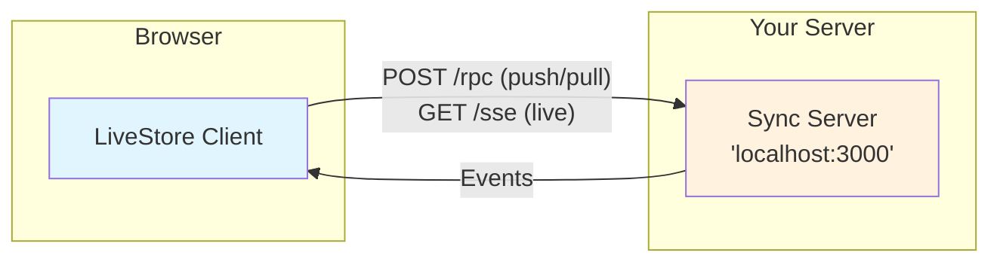

import ClientSetupSnippet from '../../_assets/code/reference/syncing/http/client-setup.ts?snippet';
import ServerSetupSnippet from '../../_assets/code/reference/syncing/http/server-setup.ts?snippet';
import ServerOptionsSnippet from '../../_assets/code/reference/syncing/http/server-options.ts?snippet';

export const SNIPPETS = {
  clientSetup: ClientSetupSnippet,
  serverSetup: ServerSetupSnippet,
  serverOptions: ServerOptionsSnippet,
};

The `@livestore/sync-http` package provides a self-hosted sync server for LiveStore using HTTP transport.

- Package: `pnpm add @livestore/sync-http`
- Protocol: HTTP RPC for push/pull, polling for live updates

## Architecture



Unlike cloud-based sync providers, `@livestore/sync-http` runs entirely on your own infrastructure. This gives you full control over data storage and makes it ideal for development, testing, and self-hosted deployments.

## Installation

```bash
pnpm add @livestore/sync-http
```

## Server setup

The server provides a simple async API for quick setup:

<SNIPPETS.serverSetup />

### Server options

<SNIPPETS.serverOptions />

## Client setup

Connect your LiveStore client to the sync server:

<SNIPPETS.clientSetup />

## Storage backends

### Memory storage (default)

Events are stored in memory. Data is lost when the server restarts. Best for development and testing.

```ts
storage: { type: 'memory' }
```

### SQLite storage

Events are persisted to SQLite. Coming soon.

```ts
storage: { type: 'sqlite', dataDir: './data' }
```

## Live pull

The HTTP sync provider supports live pulls via polling. When `live: true` is passed to `pull`:

1. Initial pull fetches all events since cursor
2. Client polls at configured interval (default 5s) for new events
3. Each poll returns new events since the last known position

Configure the poll interval on the client:

```ts
const backend = makeHttpSync({
  url: 'http://localhost:3000',
  livePull: {
    pollInterval: 2000, // Poll every 2 seconds
  },
})
```

## Endpoints

The server exposes these endpoints:

| Endpoint | Method | Description |
|----------|--------|-------------|
| `/rpc` | POST | RPC endpoint for push/pull operations |
| `/sse/:storeId` | GET | Server-Sent Events for live updates |
| `/health` | GET | Health check endpoint |

## When to use

**Best for:**
- Local development and testing
- Self-hosted deployments with full data control
- Simple sync setups without external dependencies
- Prototyping before moving to a production sync backend

**Consider alternatives for:**
- Production deployments requiring high availability (use [Cloudflare](/sync-providers/cloudflare/))
- Existing ElectricSQL infrastructure (use [ElectricSQL](/sync-providers/electricsql/))
- Managed event streaming (use [S2](/sync-providers/s2/))
