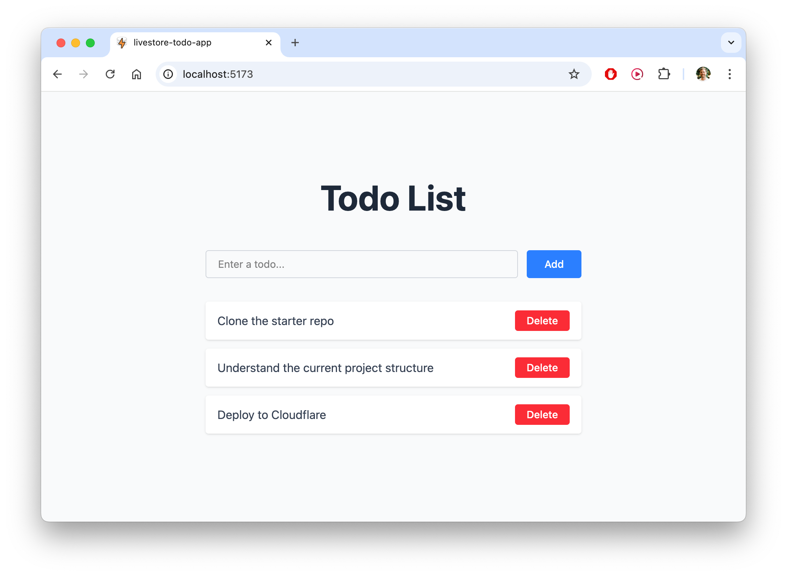
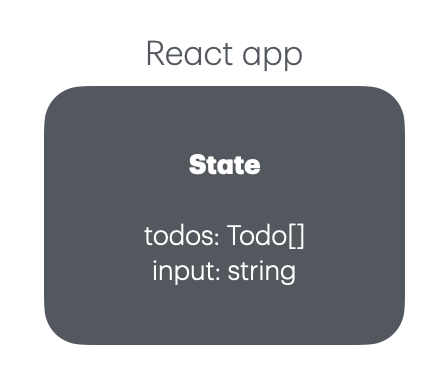

## Set up a starter project with React, Vite & Tailwind

We have prepared a starter project for you that you can use as a starting point for the tutorial.

Go ahead and clone it via the following command:

```bash
git clone git@github.com:nikolasburk/livestore-tutorial-starter.git livestore-todo-app
```

Once you've cloned the repository, you can navigate to the project directory and install the dependencies:

```bash
cd livestore-todo-app
pnpm install
```

The project currently is set up as follows:
- Minimal project created via `vite create` using React and TypeScript
- Using TailwindCSS for styling
- Has basic functionality for adding and deleting todos via local `React.useState`

Run the app with:

```bash
pnpm dev
```

Here's the UI you're going to see after adding a few todos:



Let's take a quick moment to understand how the app is currently implemented:

All relevant code lives in `App.tsx`. Here's a simplified version of it:

```ts
interface Todo {
  id: number
  text: string
}

function App() {
  const [todos, setTodos] = useState<Todo[]>([])
  const [input, setInput] = useState('')

  const addTodo = () => {
    const newTodo: Todo = {
      id: Date.now(),
      text: input
    }
    setTodos([...todos, newTodo])
    setInput('')
  }

  const deleteTodo = (id: number) => {
    setTodos(todos.filter(todo => todo.id !== id))
  }

  return (
    // Render input text field and todo list ...
    // ... and invoke `addTodo` and `deleteTodo` 
    // ... when the buttons are clicked. 
  )
}
```

For any React developer, this is a very familiar setup:




We have two pieces of state:
- application state: `todos: Todo[]`
- UI state: `input: string`

The "problem" with this code is that the todo items are not _persisted_, meaning they vanish when:
- the page is refreshed in the browser
- the development server is restarted

In the next steps, you'll learn how to persist the todos in the list, so that they'll "survive" both actions. 

Even more: They will not only persist, they will automatically sync across multiple browsers tabs/windows, and even across devices—without you needing to do anything. That's the power of LiveStore!