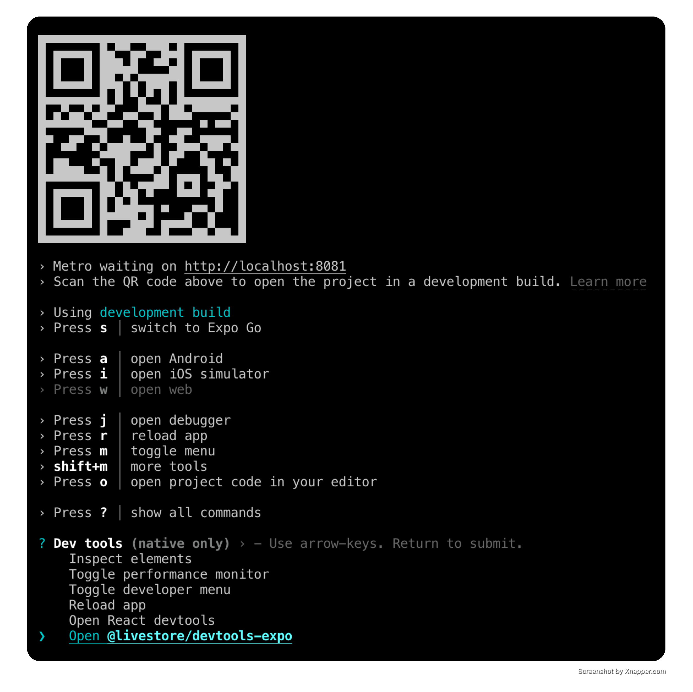

import { Code, Steps, Tabs, TabItem } from '@astrojs/starlight/components'
import { makeTiged } from '../../../../../data.js'
import babelConfigCode from '../../../../../../examples/standalone/expo-todomvc/babel.config.js?raw'
import metroConfigCode from '../../../../../../examples/standalone/expo-todomvc/metro.config.js?raw'
import eventsCode from '../../../../../../examples/standalone/expo-todomvc/src/livestore/events.ts?raw'
import schemaCode from '../../../../../../examples/standalone/expo-todomvc/src/livestore/schema.ts?raw'
import rootCode from '../../../../../../examples/standalone/expo-todomvc/src/Root.tsx?raw'
import headerCode from '../../../../../../examples/standalone/expo-todomvc/src/components/NewTodo.tsx?raw'
import mainSectionCode from '../../../../../../examples/standalone/expo-todomvc/src/components/ListTodos.tsx?raw'

export const CODE = {
  babelConfig: babelConfigCode,
  metroConfig: metroConfigCode,
  schema: schemaCode,
  root: rootCode,
  header: headerCode,
  mainSection: mainSectionCode,
}

### Prerequisites

To use [LiveStore](/) with [Expo](https://docs.expo.dev/), ensure your project has the [New Architecture](https://docs.expo.dev/guides/new-architecture/) enabled. This is required for transactional state updates.

### Option A: Quick start

For a quick start we recommend using our template app following the steps below.

For existing projects see [Existing project setup](#existing-project-setup).

<Steps>

1.  **Set up project from template**

    <Code code={makeTiged('expo-todomvc')} lang="sh" />

    Replace `my-app` with your desired app name.

2.  **Install dependencies**

    It's strongly recommended to use `bun` or `pnpm` for the simplest and most reliable dependency setup (see [note on package management](/docs/misc/package-management) for more details).

    <Tabs syncKey="package-manager">
      <TabItem label="bun">
        ```bash
        bun install
        ```
      </TabItem>
      <TabItem label="pnpm">
        ```bash
        pnpm install --node-linker=hoisted
        ```

        Make sure to use `--node-linker=hoisted` when installing dependencies in your project or add it to your `.npmrc` file.
        ```
        # .npmrc
        nodeLinker=hoisted
        ```

        Hopefully Expo will also support non-hoisted setups in the future.
      </TabItem>
      <TabItem label="npm">
        ```bash
        npm install
        ```
      </TabItem>
      <TabItem label="yarn">
        When using `yarn`, make sure you're using Yarn 4 or higher with the `node-modules` linker.

        ```bash
        yarn set version stable
        yarn config set nodeLinker node-modules
        yarn install
        ```
      </TabItem>
    </Tabs>

    Pro tip: You can use [direnv](https://direnv.net/) to manage environment variables.

3.  **Run the app**

    <Tabs syncKey="package-manager">
      <TabItem label="bun">`bun ios` or `bun android`</TabItem>
      <TabItem label="pnpm">`pnpm ios` or `pnpm android`</TabItem>
      <TabItem label="npm">`npm run ios` or `npm run android`</TabItem>
      <TabItem label="yarn">`yarn ios` or `yarn android`</TabItem>
    </Tabs>

</Steps>

### Option B: Existing project setup \{#existing-project-setup\}

<Steps>

1.  **Install dependencies**

    ```bash
    bunx expo install @livestore/devtools-expo @livestore/adapter-expo @livestore/livestore @livestore/react @livestore/utils @livestore/peer-deps expo-sqlite
    ```

2.  **Add Vite meta plugin to babel config file**

    LiveStore Devtools uses Vite. This plugin emulates Vite's `import.meta.env` functionality.

    <Tabs syncKey="package-manager">
      <TabItem label="bun">`bun add -d babel-plugin-transform-vite-meta-env`</TabItem>
      <TabItem label="pnpm">`pnpm add -D babel-plugin-transform-vite-meta-env`</TabItem>
      <TabItem label="yarn">`yarn add -D babel-plugin-transform-vite-meta-env`</TabItem>
      <TabItem label="npm">`npm install --save-dev babel-plugin-transform-vite-meta-env`</TabItem>
    </Tabs>

    In your `babel.config.js` file, add the plugin as follows:

    <Code code={CODE.babelConfig} lang="js" title="babel.config.js" />

3.  **Update Metro config**

    Add the following code to your `metro.config.js` file:

    <Code code={CODE.metroConfig} lang="js" title="metro.config.js" />

</Steps>

## Events

Create a file named `events.ts` inside the `livestore` folder. This file stores the events your app uses to interact with the database.

Use the `Events` and `Schema` modules from `@livestore/livestore` to define your events.

Here's an example:

<Code code={eventsCode} lang="ts" title="src/livestore/events.ts" />

## Define your schema

To define the data structure for your app, set up a schema that specifies the tables and fields your app uses.

- In `src`, create a `livestore` folder and inside it create a file named `schema.ts`. This file defines the tables and data structures for your app.

- In `schema.ts`, define a table to represent a data model, such as a `todos`.

Here's an example:

<Code code={CODE.schema} lang="ts" title="src/livestore/schema.ts" />

## Add the LiveStore Provider

To make the LiveStore available throughout your app, wrap your app's root component with the `LiveStoreProvider` component from `@livestore/react`. This provider manages your app’s data store, loading, and error states.

## Add the LiveStore Provider

To make the LiveStore available throughout your app, wrap your app's root component with the `LiveStoreProvider` component from `@livestore/react`. This provider manages your app’s data store, loading, and error states.

Here's an example:

<Code code={CODE.root} lang="tsx" title="src/Root.tsx" />

### Commit events

After wrapping your app with the `LiveStoreProvider`, you can use the `useStore` hook from any component to commit events.

Here's an example:

<Code code={CODE.header} lang="tsx" title="src/components/NewTodo.tsx" />

## Queries

To retrieve data from the database, first define a query using `queryDb` from `@livestore/livestore`. Then, execute the query with the `useQuery` hook from `@livestore/react`.

Consider abstracting queries into a separate file to keep your code organized, though you can also define them directly within components if preferred.

Here's an example:

<Code code={CODE.mainSection} lang="tsx" title="src/components/ListTodos.tsx" />

## Devtools

To open the devtools, run the app and from your terminal press `shift + m`, then select LiveStore Devtools and press `Enter`.



This will open the devtools in a new tab in your default browser.


Use the devtools to inspect the state of your LiveStore database, execute events, track performance, and more.

## Database location

### With Expo Go

To open the database in Finder, run the following command in your terminal:

```bash
open $(find $(xcrun simctl get_app_container booted host.exp.Exponent data) -path "*/Documents/ExponentExperienceData/*livestore-expo*" -print -quit)/SQLite
```

### With development builds

For development builds, the app SQLite database is stored in the app's Library directory.

Example:
`/Users/<USERNAME>/Library/Developer/CoreSimulator/Devices/<DEVICE_ID>/data/Containers/Data/Application/<APP_ID>/Documents/SQLite/app.db`

To open the database in Finder, run the following command in your terminal:

```bash
open $(xcrun simctl get_app_container booted [APP_BUNDLE_ID] data)/Documents/SQLite
```

Replace `[APP_BUNDLE_ID]` with your app's bundle ID. e.g. `dev.livestore.livestore-expo`.

## Further notes

- LiveStore doesn't yet support Expo Web (see [#130](https://github.com/livestorejs/livestore/issues/130))
