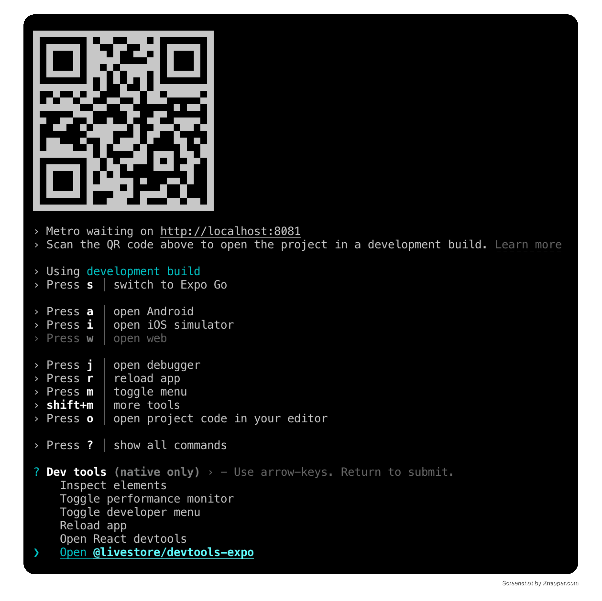
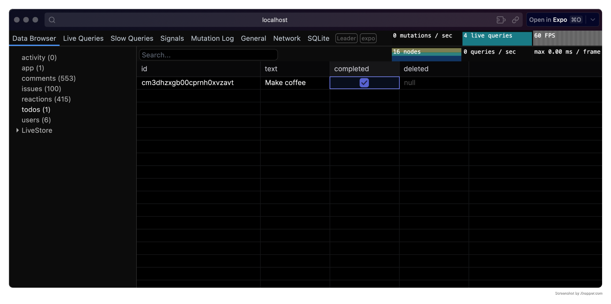

import { Steps, Tabs, TabItem } from '@astrojs/starlight/components'

### Prerequisites

To use [LiveStore](/) with [Expo](https://docs.expo.dev/), ensure your project has the [New Architecture](https://docs.expo.dev/guides/new-architecture/) enabled. This is required for transactional state updates.

### Option A: Quick start

For a quick start we recommend using our template app following the steps below.

For existing projects see [Existing project setup](#existing-project-setup).

<Steps>

1.  **Set up project from template**

    ```bash
    npx tiged --mode=git git@github.com:livestorejs/livestore/examples/standalone/expo-todomvc my-app
    ```

    Replace `my-app` with your desired app name.

2.  **Install dependencies**

    It's strongly recommended to use `bun` for the simplest and most reliable dependency setup.

            <Tabs syncKey="package-manager">

        <TabItem label="bun">

    `bun install`

                	You can ignore the peer-dependency warnings.
                </TabItem>
                <TabItem label="pnpm">
                	`pnpm install --node-linker=hoisted`

                	Make sure to use `--node-linker=hoisted` when installing dependencies in your project or add it to your `.npmrc` file.
                	```
                	# .npmrc
                	nodeLinker=hoisted
                	```

                	Hopefully Expo will also support non-hoisted setups in the future.
                </TabItem>
                <TabItem label="npm">
                	Given `npm` doesn't automatically install peer dependencies you'll also need to also install the following peer dependencies:
                	```
                	npm install @effect/experimental @effect/opentelemetry @effect/platform @effect/platform-browser @effect/schema @opentelemetry/api effect
                	```

                	Going forward you can use `npm install` again to install the dependencies.
                </TabItem>
                <TabItem label="yarn">
                	When using `yarn`, make sure you're using Yarn 4 or higher with the `node-modules` linker.

                	```
                	yarn set version stable
                	yarn config set nodeLinker node-modules
                	yarn install
                	```

                	Additionally, given `yarn` doesn't automatically install peer dependencies you'll also need to install the following peer dependencies:
                	```
                	yarn add @effect/experimental @effect/opentelemetry @effect/platform @effect/platform-browser @effect/schema @opentelemetry/api effect
                	```
                </TabItem>

            </Tabs>

    Pro tip: You can use [direnv](https://direnv.net/) to manage environment variables.

3.  **Run the app**

    <Tabs syncKey="package-manager">
      <TabItem label="bun">`bun ios` or `bun android`</TabItem>
      <TabItem label="pnpm">`pnpm ios` or `pnpm android`</TabItem>
      <TabItem label="npm">`npm run ios` or `npm run android`</TabItem>
      <TabItem label="yarn">`yarn ios` or `yarn android`</TabItem>
    </Tabs>

</Steps>

### Option B: Existing project setup

<Steps>

1.  **Install dependencies**

    ```bash
    npx expo install @livestore/devtools-expo @livestore/adapter-expo @livestore/livestore @livestore/react @livestore/utils effect expo-sqlite
    ```

2.  **Add Vite meta plugin to babel config file**

    LiveStore Devtools uses Vite. This plugin emulates Vite's `import.meta.env` functionality.

    <Tabs syncKey="package-manager">
      <TabItem label="bun">`bun add -d babel-plugin-transform-vite-meta-env`</TabItem>
      <TabItem label="pnpm">`pnpm add -D babel-plugin-transform-vite-meta-env`</TabItem>
      <TabItem label="yarn">`yarn add -D babel-plugin-transform-vite-meta-env`</TabItem>
      <TabItem label="npm">`npm install --save-dev babel-plugin-transform-vite-meta-env`</TabItem>
    </Tabs>

    In your `babel.config.js` file, add the plugin as follows:

    ```js
    module.exports = function (api) {
      api.cache(true)
      return {
        presets: ['babel-preset-expo'],
        plugins: ['babel-plugin-transform-vite-meta-env', '@babel/plugin-syntax-import-attributes'],
      }
    }
    ```

3.  **Update Metro config**

    Add the following code to your `metro.config.js` file:

    ```js
    const { getDefaultConfig } = require('expo/metro-config')
    const { addLiveStoreDevtoolsMiddleware } = require('@livestore/devtools-expo')

    /** @type {import('expo/metro-config').MetroConfig} */
    const config = getDefaultConfig(__dirname)

    config.resolver.unstable_enableSymlinks = true
    config.resolver.unstable_enablePackageExports = true
    config.resolver.unstable_conditionNames = ['require', 'default']

    // Add LiveStore Devtools middleware only in a local development environment
    if (!process.env.CI && process.stdout.isTTY) {
      addLiveStoreDevtoolsMiddleware(config, { schemaPath: './schema/index.ts' })
    }

    module.exports = config
    ```

</Steps>

## Define your schema

To define the data structure for your app, set up a schema that specifies the tables and fields your app uses.

- In your project root, create a **schema** folder and inside it create a file named **index.ts**. This file defines the tables and data structures for your app.

- In `index.ts`, define a table to represent a data model, such as a `todos`.

Here's an example:

```ts
import { DbSchema, makeSchema } from '@livestore/livestore'
import * as mutations from './mutations'

const todos = DbSchema.table(
  'todos',
  {
    id: DbSchema.text({ primaryKey: true }), // Unique identifier for each todo item
    text: DbSchema.text({ default: '' }), // Text content of the todo
    completed: DbSchema.boolean({ default: false }), // Status of the todo item
    deleted: DbSchema.integer({ nullable: true, schema: Schema.DateFromNumber }), // Optional field to mark deletion
  },
  { deriveMutations: true }, // Automatically derive mutations for this table
)

export type Todo = DbSchema.FromTable.RowDecoded<typeof todos>

export const tables = {
  todos,
}

export const schema = makeSchema({
  tables,
  mutations: {
    // Add more mutations
    ...mutations,
  },
  migrations: { strategy: 'from-mutation-log' }, // Define migration strategy
})

export * as mutations from './mutations'
```

## Mutations

Create a file named `mutations.ts` inside the `schema` folder. This file stores the mutations your app uses to interact with the database.

A "mutation" is a function that encapsulates raw database queries. It ensures updates to your LiveStore are made in a safe, consistent, and reliable way. Mutations help prevent errors and keep your database operations robust.

Use the `Schema` module from `effect` along with `defineMutation` and `sql` from `@livestore/livestore` to define these functions. These tools let you create fully typed mutations for secure and efficient database interactions.

Here's an example:

```ts
import { Schema } from 'effect'
import { defineMutation, sql } from '@livestore/livestore'

export const todoCreated = defineMutation(
  'todoCreated',
  Schema.Struct({ id: Schema.String, text: Schema.String }),
  sql`INSERT INTO todos (id, text, completed) VALUES ($id, $text, false)`,
)

export const todoCompleted = defineMutation(
  'todoCompleted',
  Schema.Struct({ id: Schema.String }),
  sql`UPDATE todos SET completed = true WHERE id = $id`,
)

export const todoDeleted = defineMutation(
  'todoDeleted',
  Schema.Struct({ id: Schema.String, deleted: Schema.DateFromNumber }),
  sql`UPDATE todos SET deleted = $deleted WHERE id = $id`,
)
```

## Add the LiveStore Provider

To make the LiveStore available throughout your app, wrap your app's root component with the `LiveStoreProvider` component from `@livestore/react`. This provider manages your app’s data store, loading, and error states.

Here's an example:

```tsx
import React from 'react'
import { Stack } from 'expo-router'
import { makeAdapter } from '@livestore/adapter-expo'
import { BaseGraphQLContext, LiveStoreSchema, sql, Store } from '@livestore/livestore'
import { LiveStoreProvider } from '@livestore/react'
import { cuid } from '@livestore/utils/cuid'
import { Button, Text, unstable_batchedUpdates as batchUpdates } from 'react-native'

import { mutations, schema } from '../schema/index'

const adapter = makeAdapter()

export default function RootLayout() {
  const [, rerender] = React.useState({})

  return (
    <LiveStoreProvider
      boot={boot}
      schema={schema}
      adapter={adapter}
      batchUpdates={batchUpdates}
      renderLoading={(_) => <Text>Stage: {_.stage}</Text>}
      renderShutdown={() => <Button title="Reload" onPress={() => rerender({})} />}
      renderError={(error: any) => <Text>Error: {JSON.stringify(error, null, 2)}</Text>}
    >
      <Stack>
        <Stack.Screen name="index" />
      </Stack>
    </LiveStoreProvider>
  )
}

/**
 * This function is called when the app is booted.
 * It is used to initialize the database with initial data.
 */
const boot = (store: Store<BaseGraphQLContext, LiveStoreSchema>) => {
  // If the todos table is empty, add an initial todo
  if (store.__select(sql`SELECT count(*) as count FROM todos`)[0]!.count === 0) {
    store.mutate(mutations.todoCreated({ id: cuid(), text: '☕ Make coffee' }))
  }
}
```

### Use a mutation

After wrapping your app with the `LiveStoreProvider`, you can use the `useStore` hook from any component to execute mutations.

Here's an example:

```ts
import { useStore } from '@livestore/react'
import { todoDeleted } from '@/schema/mutations'

export default function HomeScreen() {
  const { store } = useStore()
  return (
    <Button
      title="Delete my todo"
      onPress={() => {
        store.mutate(todoDeleted({ id: '1', deleted: Date.now() }))
      }}
    />
  )
}
```

## Queries

To retrieve data from the database, first define a query using `querySQL` from `@livestore/livestore`. Then, execute the query with the `useQuery` hook from `@livestore/react`.

Consider abstracting queries into a separate file to keep your code organized, though you can also define them directly within components if preferred.

Here's an example:

```ts
import { View, Text } from 'react-native'
import { useQuery } from '@livestore/react'
import { querySQL, sql } from '@livestore/livestore'
import { Schema } from 'effect'
import { tables } from '@/schema'

export default function HomeScreen() {
  // Define a query
  const todosQuery = querySQL(sql`SELECT * FROM todos`, {
    schema: Schema.Array(tables.todos.schema),
    label: 'todos',
  })

  // Use the query
  const todos = useQuery(todosQuery)

  console.log(todos)
  // Output:
  // [
  //   {
  //     id: "1",
  //     completed: false,
  //     deleted: null,
  //     text: "Make coffee"
  //   }
  // ]

  return (
    <View>
      <Text>{todos[0].text}</Text>
    </View>
  )
}
```

## Devtools

To open the devtools, run the app and from your terminal press `shift + m`, then select LiveStore Devtools and press `Enter`.



This will open the devtools in a new tab in your default browser.



Use the devtools to inspect the state of your LiveStore database, execute mutations, track performance, and more.

## Database location

### With Expo Go

To open the database in Finder, run the following command in your terminal:

```bash
open $(find $(xcrun simctl get_app_container booted host.exp.Exponent data) -path "*/Documents/ExponentExperienceData/*livestore-expo*" -print -quit)/SQLite
```

### With development builds

For development builds, the app SQLite database is stored in the app's Library directory.

Example:
`/Users/<USERNAME>/Library/Developer/CoreSimulator/Devices/<DEVICE_ID>/data/Containers/Data/Application/<APP_ID>/Documents/SQLite/app.db`

To open the database in Finder, run the following command in your terminal:

```bash
open $(xcrun simctl get_app_container booted [APP_BUNDLE_ID] data)/Documents/SQLite
```

Replace `[APP_BUNDLE_ID]` with your app's bundle ID. e.g. `dev.livestore.livestore-expo`.

## Further notes

- LiveStore doesn't yet support Expo Web (see [#130](https://github.com/livestorejs/livestore/issues/130))
